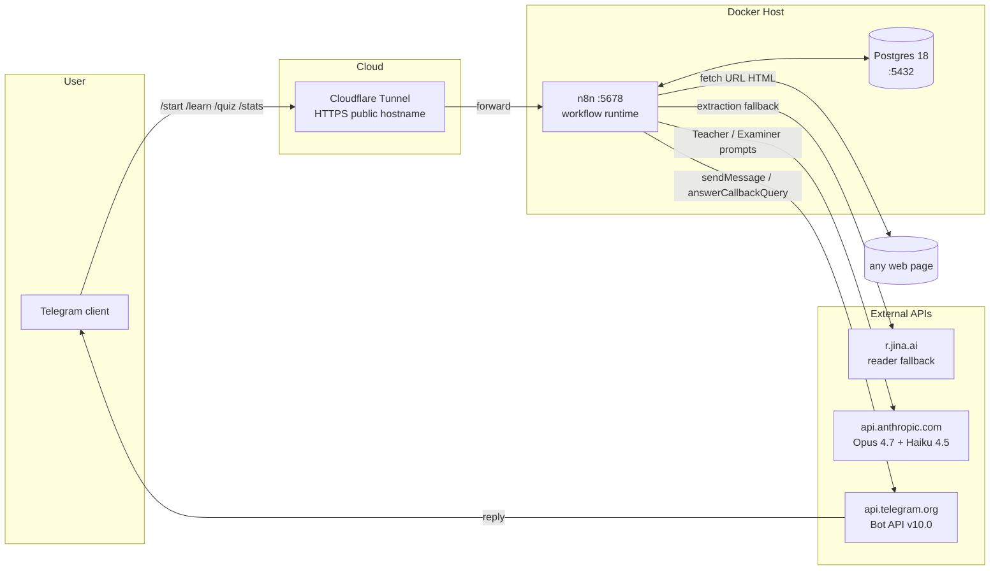
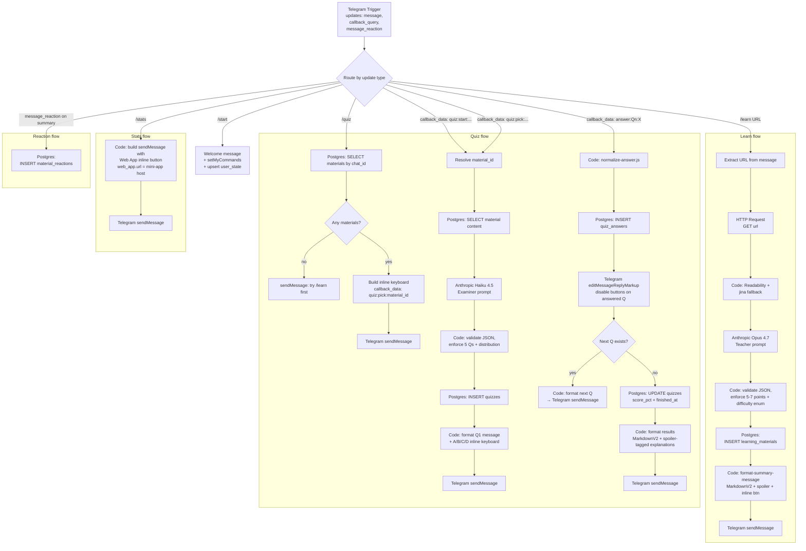

# Architecture — Task 3

> n8n workflow design: nodes, connections, data flow.
> Source of truth before the workflow JSON is exported.

## C4 — System context



## Workflow DAG



## Node-by-node spec

| Node ID | Type | Purpose | Key parameters |
|---------|------|---------|----------------|
| `trigger` | Telegram Trigger | Webhook entry | Updates: `message`, `callback_query`, `message_reaction`. Bot token credential. |
| `route` | Switch | Dispatch by update type | Conditions inspect `{{ $json.message.text }}` start-match + `$json.callback_query.data` prefix. |
| `hello` | Function | Welcome + setMyCommands | Output: text + sendMessage payload + Bot API call setMyCommands. |
| `learn_start` | Function | Parse URL from `/learn <url>` | Regex `^\/learn\s+(https?:\/\/\S+)$`. Fallback: graceful error. |
| `url_fetch` | HTTP Request | GET the URL | Method GET, follow redirects, 15s timeout, sane UA header. |
| `extract` | Code (JS) | Readability + jina chain | `extract-content.js` snippet. Throws `EXTRACTION_FAILED` on chain fail. |
| `teacher` | Anthropic Chat | Run Teacher prompt | Model `claude-opus-4-7`. System prompt from `prompts/teacher.md`. max_tokens 1500. |
| `parse_teacher` | Code (JS) | Validate Teacher JSON | Enforce key_points length 5-7, difficulty enum, concepts length 3-5. |
| `insert_material` | Postgres | INSERT learning_materials | ON CONFLICT (chat_id, url) DO UPDATE → idempotent re-learn. |
| `fmt_summary` | Code (JS) | Format MarkdownV2 message | `format-summary-message.js` snippet. |
| `send_summary` | Telegram | sendMessage | parse_mode=MarkdownV2, reply_markup=inline_keyboard from previous node. |
| `quiz_list` | Postgres | SELECT materials by chat_id | LIMIT 25 (Telegram inline keyboard practical cap). |
| `topic_kbd` | Code (JS) | Build inline keyboard | Buttons titled by `title`, callback_data `quiz:pick:<material_id>`. |
| `quiz_gen` | Function | Resolve material_id from `quiz:start:` or `quiz:pick:` | Routes to the same downstream branch. |
| `select_material` | Postgres | Load material content for Examiner | SELECT content, summary_json, difficulty FROM learning_materials WHERE id = ... |
| `examiner` | Anthropic Chat | Run Examiner prompt | Model `claude-haiku-4-5-20251001`. System prompt from `prompts/examiner.md`. max_tokens 2500. |
| `parse_examiner` | Code (JS) | Validate Examiner JSON | Enforce 5 Qs, correctAnswer ∈ {A,B,C,D}, distribution check. |
| `insert_quiz` | Postgres | INSERT quizzes | Returns generated quiz_id for downstream. |
| `set_state_quiz` | Postgres | UPSERT user_state | state='quiz_in_progress', active_quiz_id=quiz_id, current_q='Q1'. |
| `fmt_question` | Code (JS) | Build Q message + A/B/C/D inline keyboard | callback_data `answer:Qn:X` per option. |
| `send_question` | Telegram | sendMessage with Q | parse_mode=MarkdownV2. |
| `answer_norm` | Code (JS) | Normalize callback answer | `normalize-answer.js` snippet. |
| `insert_answer` | Postgres | INSERT quiz_answers | UNIQUE(quiz_id, question_id) → no double-answer. |
| `edit_buttons` | Telegram | editMessageReplyMarkup | Replace with disabled buttons showing user's pick + ✓/✗. |
| `is_last` | IF | Check if answered Q is Q5 | If yes → finalize branch. |
| `finalize` | Postgres | UPDATE quizzes SET score_pct, finished_at | Computes score_pct from quiz_answers count. |
| `fmt_results` | Code (JS) | Per-Q feedback with spoiler explanations | Wrong answers → explanation in `||...||` spoiler. |
| `send_results` | Telegram | sendMessage | parse_mode=MarkdownV2. |
| `stats_btn` | Function | Build Web App button | `reply_markup.inline_keyboard[0][0].web_app.url = https://<mini-app-host>/stats?chat_id={{...}}` |
| `react_store` | Postgres | INSERT material_reactions ON CONFLICT DO NOTHING | Captures 👍/👎/❤️ on Teacher summaries. |

## State machine — `user_state`

```
idle ──/learn URL──> idle (no state needed during single-request /learn)
idle ──/quiz──>      topic_select  (waiting on quiz:pick:<id>)
topic_select ──pick──> quiz_in_progress (current_q=Q1, active_quiz_id=<id>)
quiz_in_progress ──answer Qn (n<5)──> quiz_in_progress (current_q=Qn+1)
quiz_in_progress ──answer Q5──> idle (state cleared)
quiz_in_progress ──/start or /learn during quiz──> idle (state cleared, quiz abandoned)
```

State transitions live in dedicated Postgres nodes after each action — n8n itself is stateless across executions, all state in `app.user_state`.

## Persistence guarantees

- **Across container restart**: Postgres volume `task3-postgres-data` is named (not anonymous), so `docker compose down` preserves it. Only `docker compose down -v` wipes (and that's explicit destructive).
- **Across workflow restart**: All durable state in Postgres. n8n workflow can be deactivated/reactivated without losing user materials or quiz progress.
- **Across upgrade**: `n8nio/n8n:latest` may bump versions; n8n's own metadata in Postgres handles migrations. App schema in `app.*` is versioned via `db/init/0N_*.sql` files (future migrations land as `02_xxx.sql` etc.).

## Wow features mapped to nodes

| Wow | Node |
|-----|------|
| MarkdownV2 + spoiler entities | `fmt_summary` (interview_angle spoiler), `fmt_results` (explanation spoilers) |
| `setMyCommands` programmatic | `hello` node (defensive — runs on `/start`) |
| `setBotDescription` programmatic | One-time bootstrap workflow (runs once at activation) |
| Web App button for `/stats` | `stats_btn` node — mini-app served separately (likely GitHub Pages) |
| Message reactions capture | `react_store` branch off `route` |
| Interview-angle bias | `prompts/teacher.md` + `prompts/examiner.md` system prompts |
| Multi-model orchestration | Teacher = Opus 4.7, Examiner = Haiku 4.5 |
